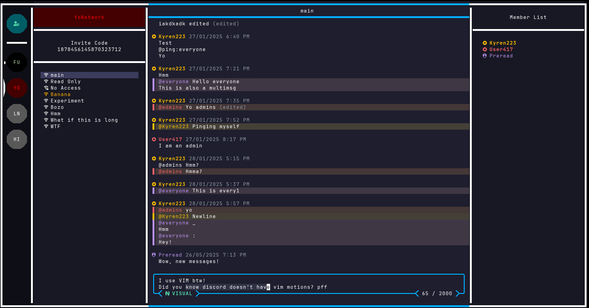

# Eko

<p>
    <picture>
      
    </picture>
    <br>
    
    
</p>

The Discord alternative for Terminal nerds.

<p>
    
</p>

Don't forget to ⭐ the repo!

## Features

- 🟢 Vim-style navigation and editing
- 🔑 SSH-like authentication using public key cryptography
- 🎨 Customizable colors
- 🖥️ Smooth and responsive TUI experience
- 📜 Open protocol for building clients and tools
- 🏠 Self-hostable or use the official instance

---

## Quick Install

Make sure to have a [Nerd Font](https://www.nerdfonts.com/) installed and enabled in your terminal.

### Install Latest Version

```
curl -sS https://eko.kyren.codes/install.sh | sh
```

### Nix Flake

There is a flake.nix at the root of this repo, you know what to do.

### Build from source

See [Building from source](#building-from-source).

## Usage

Once installed, run `eko` in a terminal.

Use `tab` / `shift+tab` to cycle, `ctrl+s` to switch between sign-in and sign-up
and `enter` to confirm.

Use an existing SSH ed25519 key (e.g `~/.ssh/id_ed25519`) or specify a new
path to generate one.

By default, you will connect to the official instance.
For self hosting, see [Self Hosting](./SELFHOSTING.md).

Press `?` to see available keybindings.
They are inspired by vim and should feel intuitive.

To ask questions, suggest features, or chat with the community,
it's recommended to join the official server.  
To do so press `a` while focused on the network list and paste `7660950781952` into it.

And that's it!

For configuration, self hosting and contributing, read below.

## Configuration

### Server-side Settings

Press `s` to open your user settings, you can change:

- Your username (pseudonym)
- Your profile description
- Whether non-trusted users can message you

### Client-side (Local) Settings

The config is stored in a `eko/config.json` in your system config directory.
This depends on your operating system, press `s` in eko to view the full path.

Local configuration is saved in eko/config.json within your system's config directory.
This path varies by OS, you can press `s` in eko to see the path.

Configurable options include (but are not limited to):

- Customize colors to create your own theme
- Enable or disable telemtry
- Set a default username for login
- Define the number of spaces per tab
- Enable or disable screen borders

## 🤝 Donations

If you like the project and want to show your support, starring it and telling about it to others
is the biggest help.

If you wish to support me financially, you can make a 1-time donation or a monthly donation
over on [my patreon](https://patreon.com/kyren223).

## Contributing

See [contributing](https://github.com/kyren223/eko/blob/master/CONTRIBUTING.md)

### Building from source

Clone the repository

```
git clone https://github.com/kyren223/eko
```

Build the executable (make sure you have `go` installed)

```
cd eko && go build -o ./eko ./cmd/client
```

Optionally move the executable to somewhere in your path so you can access it from anywhere

## Feedback

I’d love to hear your thoughts on this project.
Reach me via:

- Eko: `2102554263552` (focus the Signal pane, press `a` and paste)
- Discord: Kyren223

## Licenses

Copyright (C) 2025 Kyren223

All source code is licensed under [AGPLv3](https://github.com/kyren223/eko/raw/main/LICENSE).  
All content in the `assets` directory is licensed under [CC BY-NC-SA 4.0](https://creativecommons.org/licenses/by-nc-sa/4.0/).
Logos and artwork are copyrighted works of Kyren223.
